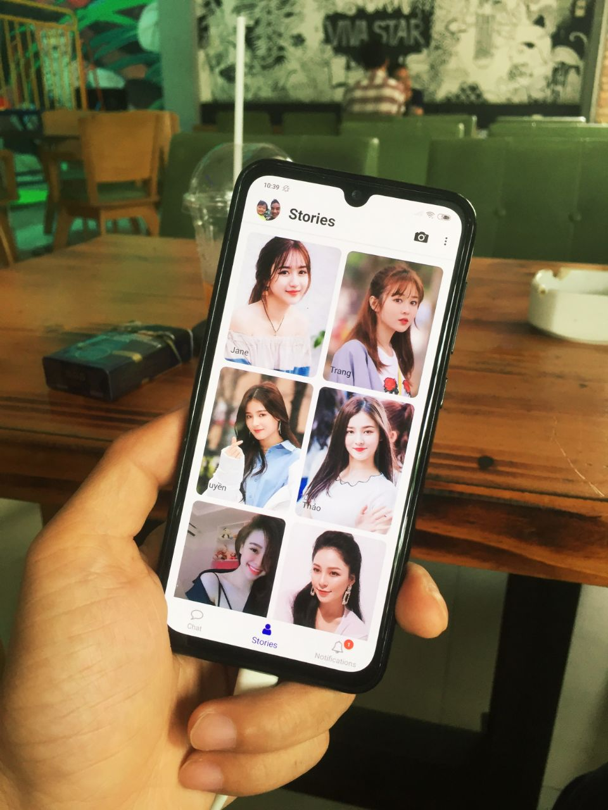
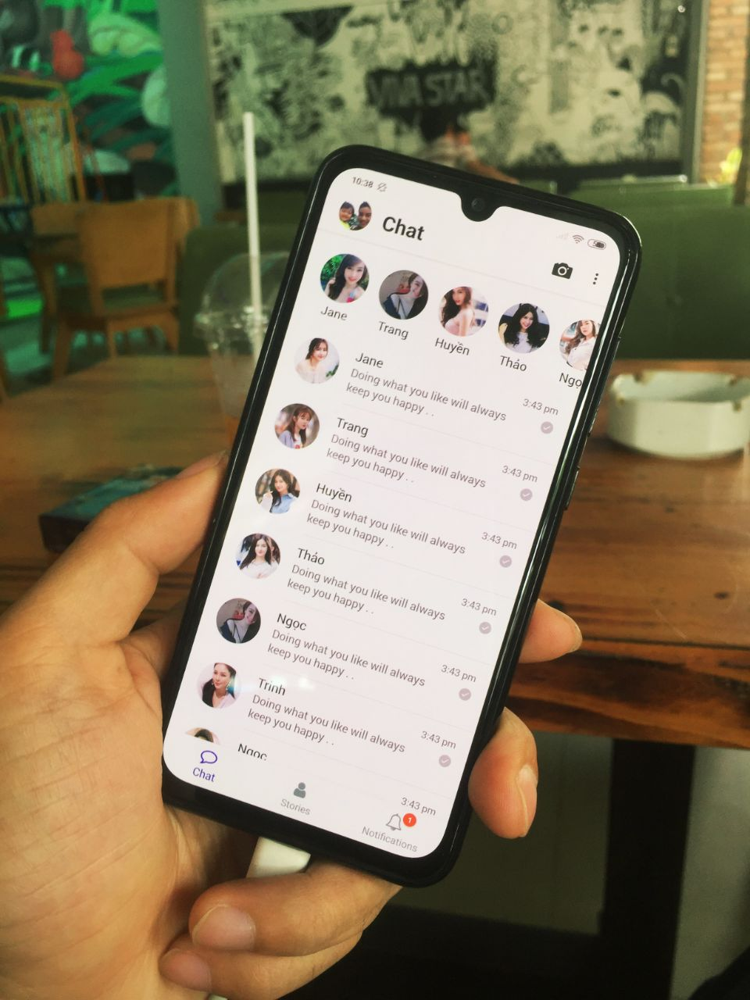

# [Flutter Facebook Messenger UI]

## Demo
- [APK](https://drive.google.com/file/d/1e7hsaJeqT0GKQhp1Q_v7x7YeuxshHeWO/view?usp=sharing)

- [Buy me a coffee](https://www.buymeacoffee.com/flutterforsale)

# Screenshot

    
     

          

             

## Clone & Install Dependencies

1) `git clone https://github.com/flutterforsale/flutter-messenger-ui.git`
2) `cd flutter-messenger-ui` - cd into your newly created project directory.
3) Run `flutter doctor` to check your Flutter Installation and checks the latest updates from the Flutter Github repository
4) Install package in pubspec.yaml - run `flutter pub get`
5) Open your emulator or your device connect with cable.
6) Run project - `flutter run` for [IOS] and [Android] OR Press F5 and select emulator

## ReactNative version

- [RNFacebookMessengerUI](https://github.com/flutterforsale/rn-messenger-ui)
